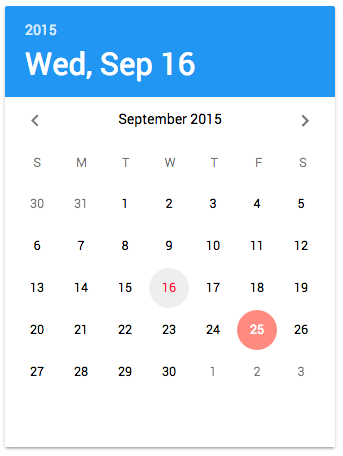

# jxl-paper-date-picker

Calendar and date picker for Polymer 1.x based on [Material Design guidelines](https://www.google.com/design/spec/components/pickers.html#pickers-date-pickers).

# Instructions

1. run `bower install jxl-paper-date-picker --save`
2. import via `<link rel="import" href="jxl-paper-date-picker.html">`
3. use via `<jxl-paper-date-picker></jxl-paper-date-picker>`

To see demo, run `node server.js`