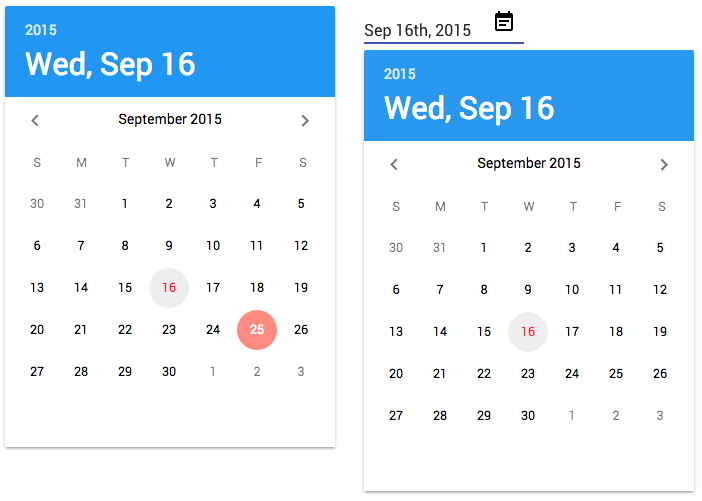

# jxl-paper-date-picker

Calendar and date picker for Polymer 1.x based on [Material Design guidelines](https://www.google.com/design/spec/components/pickers.html#pickers-date-pickers).

## Date Picker & Date Field


# Instructions

1. run `bower install jxl-paper-date-picker --save`
2. import via `<link rel="import" href="jxl-paper-date-picker.html">`
3. use via `<jxl-paper-date-picker></jxl-paper-date-picker>`

To see demo, run `node server.js`

# Example

To use the date picker:

```html
<jxl-paper-date-picker></jxl-paper-date-picker>
```
To set the selected date, use a moment date:

```javascript
<jxl-paper-date-picker id="customPicker"></jxl-paper-date-picker>
```
```javascript
this.$.customPicker.currentDate = moment('01/19/2014', 'MM DD YYYY');
```

To bind to a field:

```html
<jxl-paper-date-picker selected-date="{{selectedDate}}"></jxl-paper-date-picker>
<br />
<b>Selected Date:</b> <span>{{getPrettyDate(selectedDate)}}</span>
```

```javascript
properties: {
	selectedDate: null,
	type: Date,
	value: function(){return null;}
},

getPrettyDate: function(date)
{
	if(moment.isMoment(date) === false)
	{
		return "???";
	}
	return date.format("dddd, MMMM Do YYYY");
},
```


# Contributors

##Features

Haven't done the year change yet.

##Performance

While she peforms fine, I'm not too happy about the CSS wrapping strategy, nor about the contants recreation of days when you switch months. I attempted to [draw everything dynamically](https://github.com/JesterXL/Starting-Strength-Polymer/blob/refactor-calendar/src/client/jxl-calendar.html), but determining whether you're creating things in shadow dom or light dom is consufing. I then tried a [simple refresh approach](https://github.com/JesterXL/Starting-Strength-Polymer/blob/manual-refactor-calendar/src/client/jxl-calendar.html) using static DOM, but ran into similiar problems. Open to ideas, improvements.

##calendar vs date-picker

Why 2 calendars? If you notice the Material Design video, the only way to 2 animate 2 calendars like that is if you actually have 2 calendars. I've done this in my Flash days, and you just cycle 2 components in and out. Haven't started on that yet, but y'all are welcome to dive deep into neon land if you wish.

##DevOps

Gruntfile is a work in process. I've got Vulcan working in another project. JSHint for now is the only really useful task.


# Changelog

v0.0.1 (9.16.2015)

- initial `<jxl-paper-calendar>`
- initial `<jxl-paper-date-picker>`
- both basically work
- basic local server to see demo with optional BrowserSync support via `browser-sync start --proxy "localhost:9038" --files "*.html"`
- basic Grunt functionality, which for now, is just `grunt jshint`